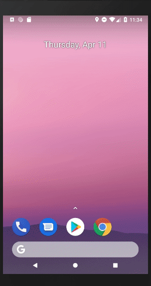

# My Recipes App

My first app with Flutter (stable version).

## Description

This app is based on demo from [raywenderlich.com](https://www.raywenderlich.com/155-android-listview-tutorial-with-kotlin). In this version I have replaced Kotlin for Dart programming language.

Also it's connected with Firestore from [Firebase](http://firebase.google.com) cloud provider.

## How it looks?

